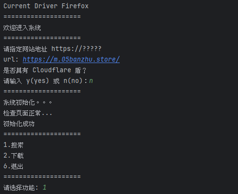
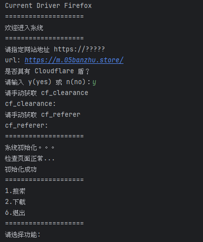
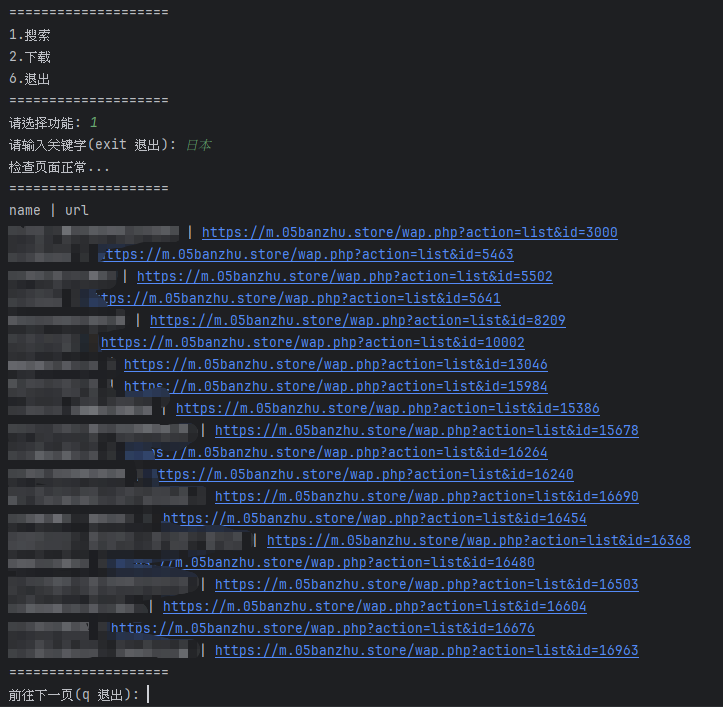
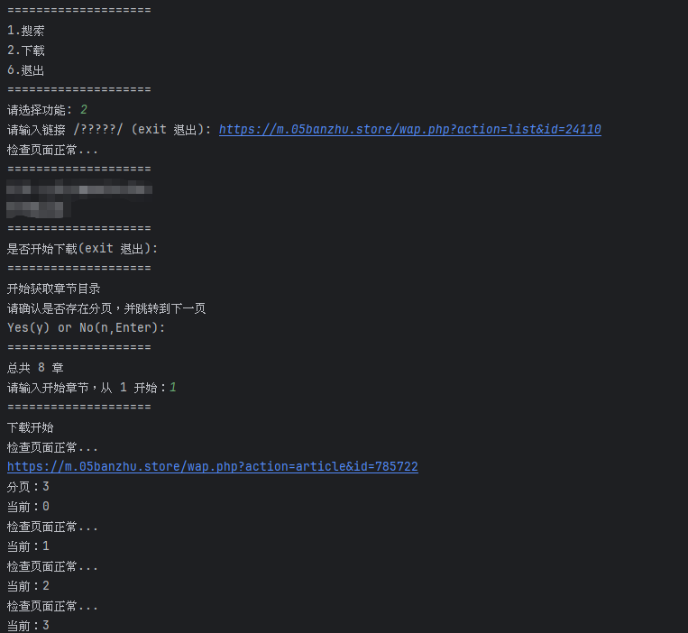
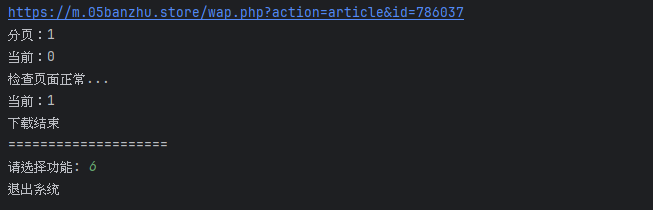

# novel-spider-banzhu

@LMingJian 2025

## 这是什么？

这是小说爬取项目 novel-spider 的特化版本，针对的是某版主网站。

> [某版主地址发布页](https://www.quan--er.com/)，更新于 2025-11-17

为什么要编写这个？

主要是因为目标网站较为特别，常规爬取手段无法生效，而为了下载小说内容，因此需要特别处理。

> 该仓库仅作学习用途，不构成任何形式的承诺或保证，本人对该项目的使用不承担任何责任‌。

## 设计思路

通过使用 Selenium 进行爬取，但由于网站比较特别，因此在爬取的时候需要引入手动操作进行人工干预（比如 Cookie 获取，验证加载完成，页面跳转等）。

在使用 Selenium 爬取时，程序将使用浏览器进行操作（不使用无头模式），以模拟真实用户操作。

- 模拟用户使用搜索框进行搜索。
- 通过链接前往书籍目录页，在书籍目录页选择章节点击。
- 在正文阅读中，模拟用户点击下一页来跳转下一章。

## 使用手册

在文件 **novel_spider_banzhu.py** 中找到最下面的 `if __name__ == '__main__':`，替换驱动地址为你本地系统中的驱动地址。

```python
if __name__ == '__main__':
    SpiderBanZhu(r'F:\Sdk\webdriver\geckodriver.exe')
```

随后，按照提示，依次输入指令，开始爬取下载。











## 难点问题

- 该网站存在极其严格的 Cloudflare 人机验证，即使使用 Selenium 也无法自动绕过。（手动获取 Cookie 值 `cf_clearance` 绕过）
- 该网站正文内容存在“图片文字”，使用特别的图片来表示文字。（判断并替换）
- 该网站正文内容存在“字体文字”，使用特别的字形来表示文字。（判断并替换）

————————————

> 更新于：2025-12-26，新版本好像没有这么严格了，因此代码进行了更新
